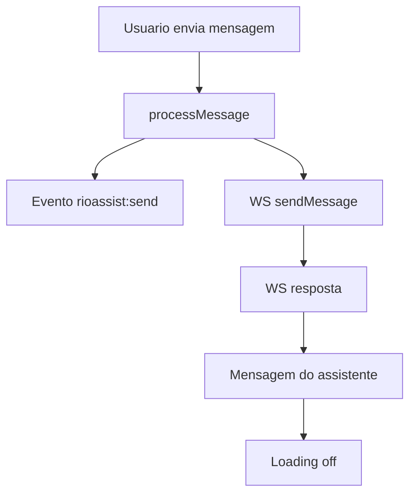
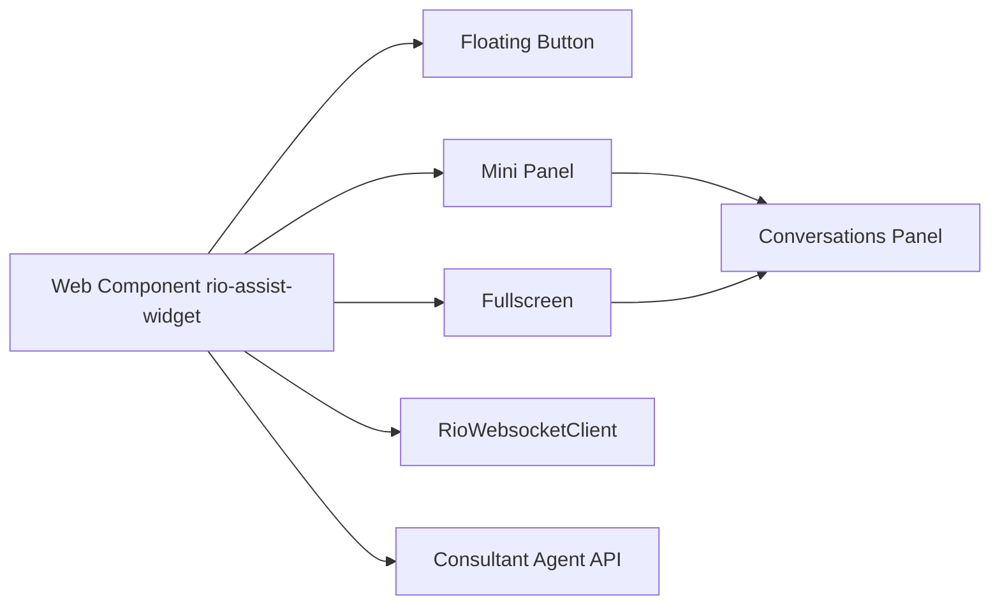
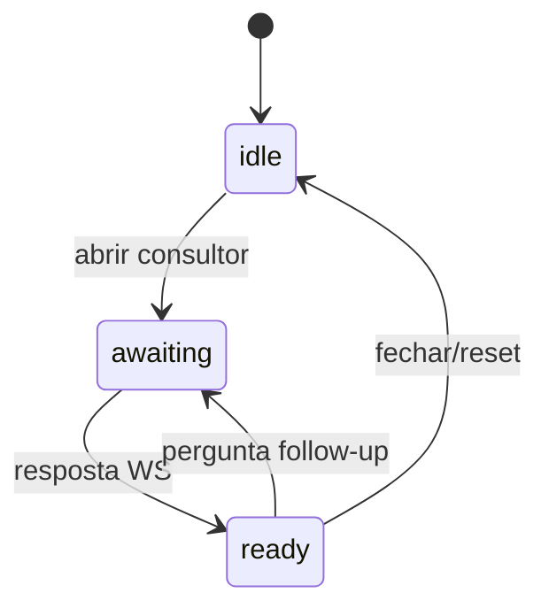
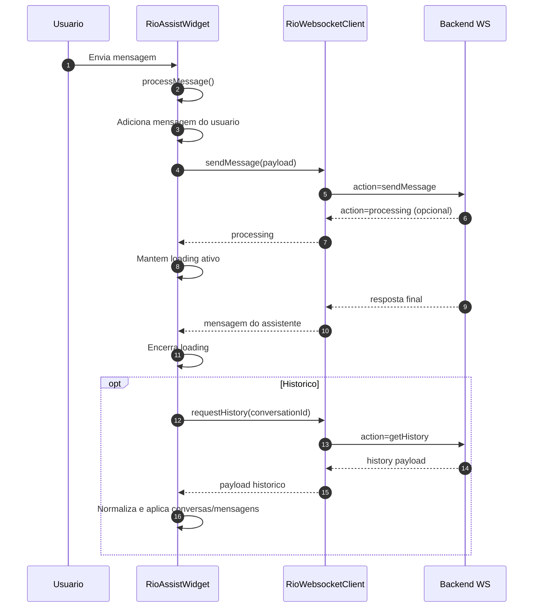

# Documentacao Tecnica - Rio Assist Widget

Data de referencia: 06/02/2026

## Arquitetura do Front

### Visao geral
O projeto entrega um widget de chat como Web Component (custom element `rio-assist-widget`). A UI e a logica vivem no componente `RioAssistWidget`, baseado em Lit (`LitElement`), com templates separados por modulo de UI (mini painel, fullscreen, botoes, conversas). A comunicacao com o backend ocorre via WebSocket dedicado ao token RIO e uma chamada REST para carregar opcoes do Agente Consultor.

### Tecnologias e frameworks
- `TypeScript` + `Vite` para build e bundle.
- `Lit` para Web Components e renderizacao reativa.
- `markdown-it` + `markdown-it-task-lists` para renderizar respostas do assistente.
- `DOMPurify` para sanitizacao do HTML antes de injetar no DOM.
- Web APIs: `WebSocket`, `MediaRecorder`, `SpeechRecognition` (quando disponivel), `Clipboard`.

### Organizacao do projeto
- `src/main.ts`: ponto de entrada, expoe `window.RioAssist.init` e injeta o custom element no DOM.
- `src/components/rio-assist/`: componente principal, estado e orquestracao de fluxos.
- `src/components/mini-panel/`: template e estilos do painel compacto.
- `src/components/fullscreen/`: template e estilos do modo tela cheia.
- `src/components/floating-button/`: botao flutuante de abertura.
- `src/components/conversations-panel/`: lista de conversas e acoes (renomear, excluir).
- `src/services/rioWebsocket.ts`: cliente WebSocket e protocolo de mensagens.
- `src/consultant-agent/consultant-agent.ts`: integracao com API do consultor e normalizacao.
- `src/consultant-agent/consultant-agent-mocks.ts`: modelos e textos default.
- `src/types/` e `src/assets/`: tipos e imagens.

### Padroes adotados
- Componentizacao por templates (Lit) e CSS isolado por componente.
- Estado reativo no `LitElement` usando `static properties` (sem store externo).
- Fluxos controlados por metodos do componente principal.
- Integracoes via `services` (WebSocket) e `consultant-agent` (REST).

## Estrutura de Componentes

### Principais componentes do chat
- `RioAssistWidget` (`src/components/rio-assist/rio-assist.ts`).
- `Mini Panel` (`src/components/mini-panel/mini-panel.template.ts`).
- `Fullscreen` (`src/components/fullscreen/fullscreen.template.ts`).
- `Conversations Panel` (`src/components/conversations-panel/conversations-panel.template.ts`).
- `Floating Button` (`src/components/floating-button/floating-button.template.ts`).

### Responsabilidades por componente
- `RioAssistWidget`: estado global do widget, orquestracao, integracoes e eventos `rioassist:*`.
- `Mini Panel`: UI principal do chat no modo compacto (mensagens, sugestoes, anexos, entrada).
- `Fullscreen`: layout em tela cheia com trilha lateral e sidebar de conversas.
- `Conversations Panel`: lista de conversas, busca, menu de acoes e scrollbar custom.
- `Floating Button`: CTA para abrir o chat com suporte a drag vertical.

### Componentes especificos do Agente Consultor
- `Consultant Agent` (`src/consultant-agent/consultant-agent.ts`).
- `Consultant Templates` (`src/consultant-agent/consultant-agent.template.ts`).

### Reutilizaveis vs. especificos
- Reutilizaveis: `Conversations Panel`, `Floating Button`, estruturas do `Mini Panel` e `Fullscreen`.
- Especificos: fluxo e templates do Agente Consultor, logica de perguntas sugeridas.

## Fluxos de Interface (UX Tecnica)

### Fluxo do chat padrao
1. Usuario abre o widget via botao flutuante.
2. Mensagem digitada ou selecionada via sugestao.
3. `processMessage` cria mensagem do usuario, dispara evento `rioassist:send` e envia via WS.
4. Estado `isLoading` ativa indicador de digitacao.
5. Resposta do WS cria mensagem do assistente e encerra `loading`.



### Fluxo do botao “Falar com consultor”
1. Usuario ativa o consultor (CTA no hero/intro).
2. UI envia mensagem inicial automatica ("Resumo da Frota") sem criar mensagem do usuario.
3. Estado `consultantAgentStage = awaiting`.
4. Ao receber resposta, sistema injeta prompt com assuntos do consultor.

```mermaid
flowchart TD
  A[CTA consultor] --> B[processMessage "Resumo da Frota"]
  B --> C[Stage awaiting]
  C --> D[Resposta WS]
  D --> E[Prompt de assuntos do consultor]
```

### Fluxo de exibicao de perguntas sugeridas (consultor)
1. Usuario escolhe um assunto do consultor.
2. UI gera mensagem do usuario com o label do assunto.
3. UI injeta follow-up com lista de perguntas para aquele assunto.
4. Ao clicar numa pergunta, envia com `consultantContext`.

### Estados da interface
- `loading`: `isLoading=true` e texto dinamico de status (com timers de 20s/60s/120s).
- `erro`: `errorMessage` para falhas de envio ou historico.
- `processamento`: mensagens WS com action `processing` mantem loading ativo sem mensagem.
- `upload`: anexos listados no rodape; erro em `attachmentError`.
- `voz`: estados `isRecording`, `voiceTranscript`, `voiceCancelDialogOpen`.

## Gerenciamento de Estado

### Como o estado da conversa e controlado
- Estado centralizado no `RioAssistWidget` via propriedades reativas do Lit.
- `messages` e `conversations` mantem o estado do chat e do historico.
- `currentConversationId` identifica a conversa ativa.

### Historico, contexto e modos
- Historico: requisitado via WS com `getHistory`.
- Contexto do consultor: enviado via `consultantContext` com `branchId`, `questionId` e `level`.
- Modo consultor vs. livre: flags `isConsultantAgent`, `consultantAgentStage`, `consultantAgentVisible` e `consultantOptionsSuppressed`.

### Persistencia
- Sem persistencia local. O historico vem do backend via WS.
- Nao usa `localStorage`/`IndexedDB` no frontend.

## Integracoes com Backend / APIs

### WebSocket principal
- URL: `wss://ws.volkswagen.latam-sandbox.rio.cloud?token=<TOKEN>`
- Cliente: `RioWebsocketClient` (`src/services/rioWebsocket.ts`).
- Acoes enviadas:
- `sendMessage`: `{ action, message, conversationId, ...extra }`.
- `getHistory`: `{ action, limit, conversationId }`.
- `renameConversation`: `{ action, conversationId, newTitle }`.
- `deleteConversation`: `{ action, conversationId }`.
- `ping`: mantem conexao viva.

### REST - Agente Consultor
- URL base: `https://consultant-api.latam-sandbox.rio.cloud/consultant/api/v1`.
- Endpoint: `GET /branches`.
- Retorno esperado: array de branches com `branchId`, `label`, `questions`.

### Payloads principais (request/response)
- `sendMessage`.
- Request: `message` (texto), `conversationId`, `isConsultantAgent`, `consultantContext`.
- Response: objeto com `message`/`response`/`text` + `action` opcional.
- `getHistory`.
- Response pode variar, normalizado pelo frontend (campos `history`, `conversations`, `items`).

### Tratamento de erros de API
- WS: falhas de conexao geram `errorMessage` e desativam `loading`.
- Historico: `conversationHistoryError` em falhas de `getHistory`.
- Acoes de conversa: captura erros e exibe dialogo com opcao de retry.

### Retry / fallback
- Retry manual para rename/delete via `retryConversationAction`.
- Nao existe retry automatico para `sendMessage`.
- `processing` do backend mantem loading sem duplicar mensagens.

## Upload de Conteudo (anexos e voz)

### Fluxo de upload de arquivos
1. Usuario seleciona arquivo(s) (ate 3).
2. Validacao de tamanho (<= 10 MB) e formato.
3. Preview local (imagens) e lista de anexos no rodape.
4. Ao enviar, anexos sao limpos do estado.

### Validacoes de front
- Quantidade maxima: 3 arquivos.
- Tamanho maximo: 10 MB.
- Tipos aceitos: `txt/doc/docx`, `xls/xlsx/csv`, `pdf`, `jpg/jpeg/png`, `wav/mp3/m4a/ogg/webm`.

### Feedback visual
- Cards/miniaturas de anexos no rodape.
- Mensagens de erro em `attachmentError`.

### Estados de erro e sucesso
- Erros de tipo/tamanho geram `attachmentError`.
- Upload nao esta integrado ao backend: os arquivos sao enviados apenas no evento `rioassist:send` (nao seguem no payload WS atual).

### Voz
- Gravacao via `MediaRecorder` e transcricao via `SpeechRecognition` quando suportado.
- Se a transcricao falha, a UI informa indisponibilidade.

## Seguranca e Boas Praticas

### Tokens e autenticacao
- Token RIO passado por atributo `data-rio-token` ou `init()`.
- O token e enviado como query param do WebSocket.

### Boas praticas no front
- Sanitizacao de HTML com `DOMPurify` (bloqueia `script` e `style`).
- Markdown com `html: false` e filtragem de tags permitidas.
- Links externos forcam `target=_blank` e `rel=noopener noreferrer`.

### Limitacoes / pontos de atencao
- Token em atributo `data-*` pode ser inspecionado no DOM. Evitar expor em ambientes publicos.
- `apiBaseUrl` existe nos atributos/eventos, mas nao e usado para chamada HTTP no front atual.

## Pontos de Evolucao e Divida Tecnica

### Limitacoes atuais
- Upload de arquivos nao integra o backend (apenas evento local).
- `apiBaseUrl` nao e utilizado.
- Normalizacao de historico depende de heuristicas para campos inconsistentes do backend.

### Pontos para refatoracao futura
- Modularizar logica de historico e consultor em services dedicados.
- Separar state management em store dedicado se o widget crescer.
- Consolidar tratamento de erros e estados de loading em helper comum.

### Premissas tecnicas
- Backend suporta WebSocket com token no query string.
- Mensagens do backend sao JSON com campos variaveis.
- Ambientes do navegador com suporte a `WebSocket` e APIs de midia.

## Diagramas complementares

## Diagramas complementares

### Componentes (alto nivel)


### Estados do consultor


### Sequencia de mensagem e historico


## Observacoes finais
- O widget emite eventos `rioassist:*` para integracoes externas (abertura, envio, acoes de mensagem e conversas).
- O fluxo de historico e conversas depende do backend e esta preparado para payloads heterogeneos.
